# 🛒 E-Commerce App UI - Jetpack Compose

This repository contains a modern e-commerce mobile app UI built using **Jetpack Compose**. It demonstrates a clean and responsive user interface suitable for shopping platforms, built entirely with Compose and Material Design 3 components.

## ✨ Features

- Home screen with product listings
- Product detail screen with image, price, and description
- Shopping cart with quantity adjustment
- Search functionality (UI only)
- Login & Registration screens
- Category and filter screens
- Address screen
- Profile Screen with save and update 
- Order summary
- Fully responsive UI using modern Compose practices

## 📸 Screenshots

Below are the screenshots of the app demonstrating various screens and flows:

### 🔹 App UI Screens

  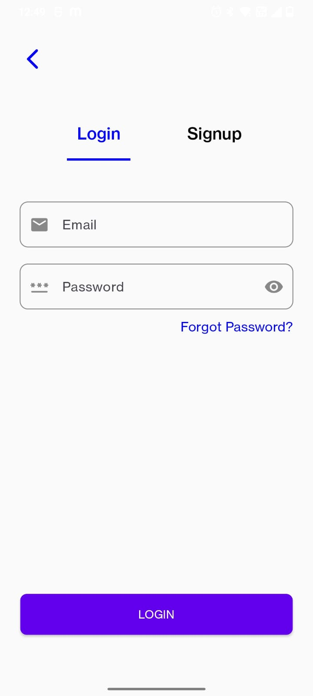
  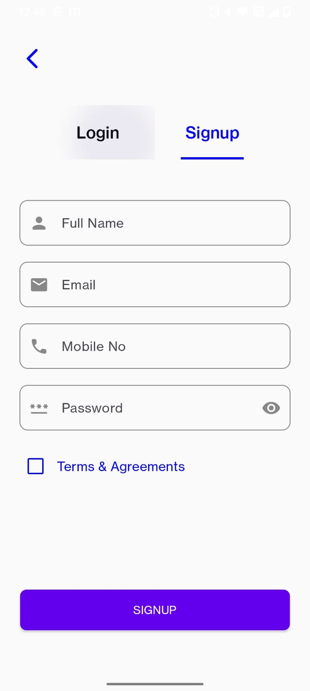
  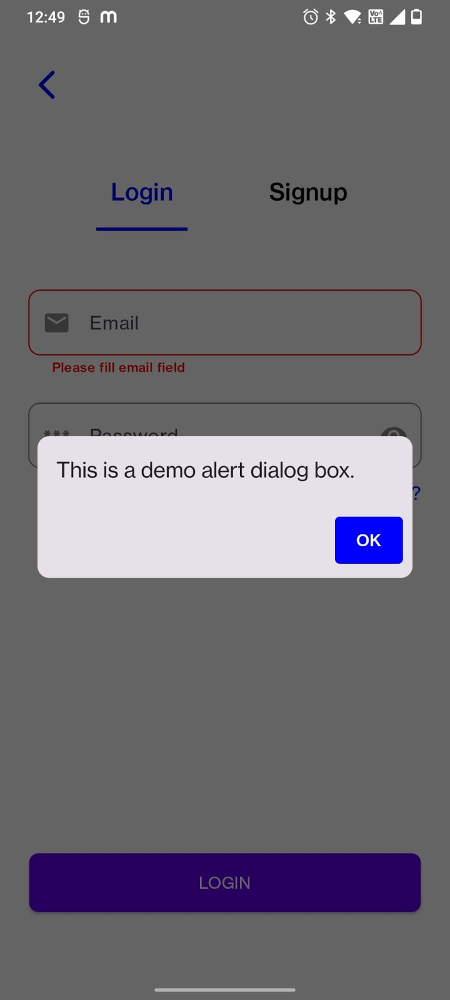

  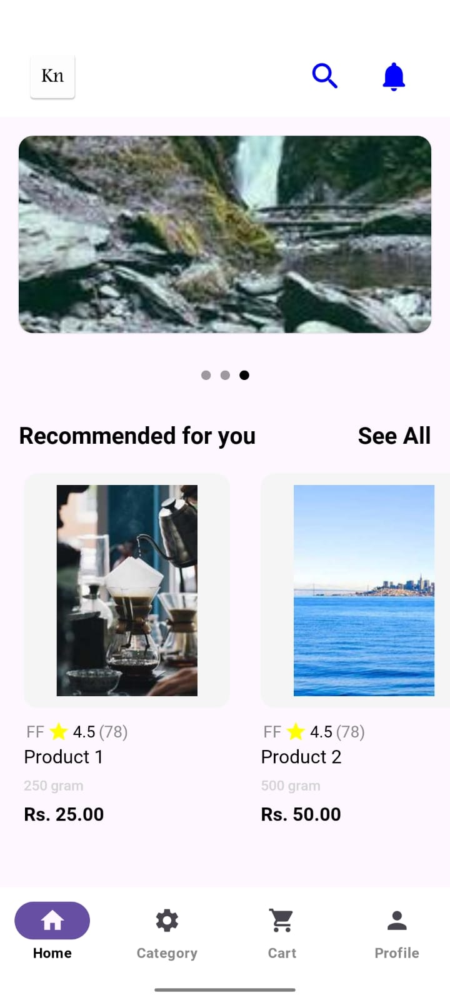
  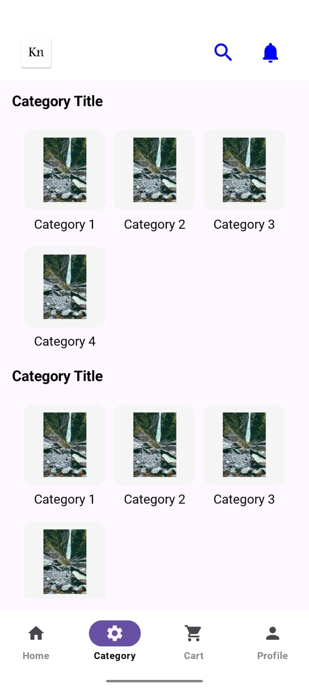
  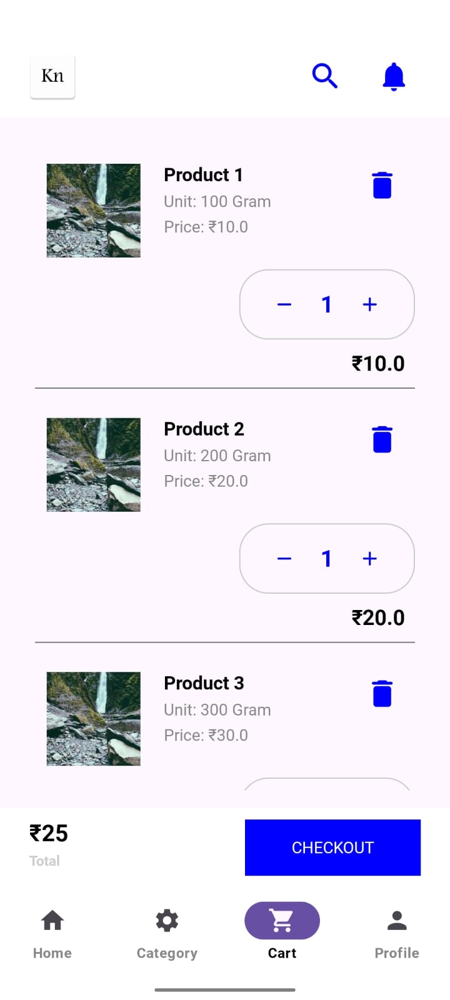

  
  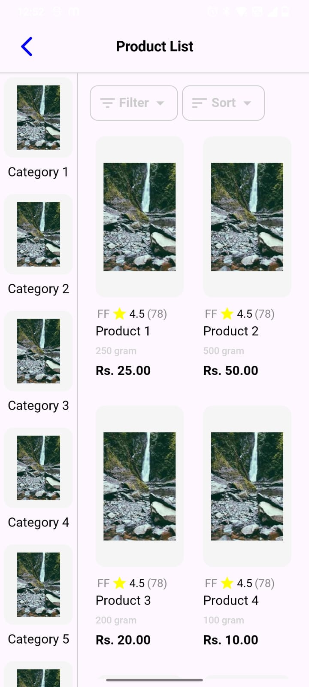
  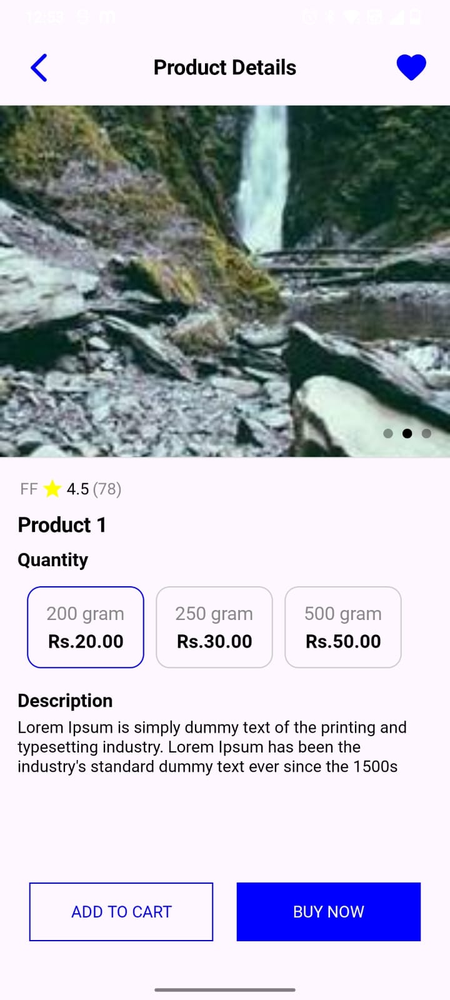

  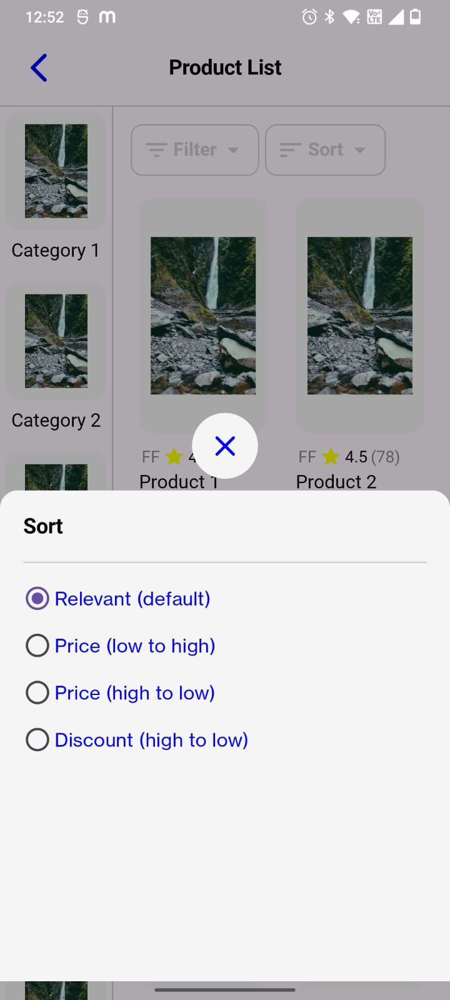
  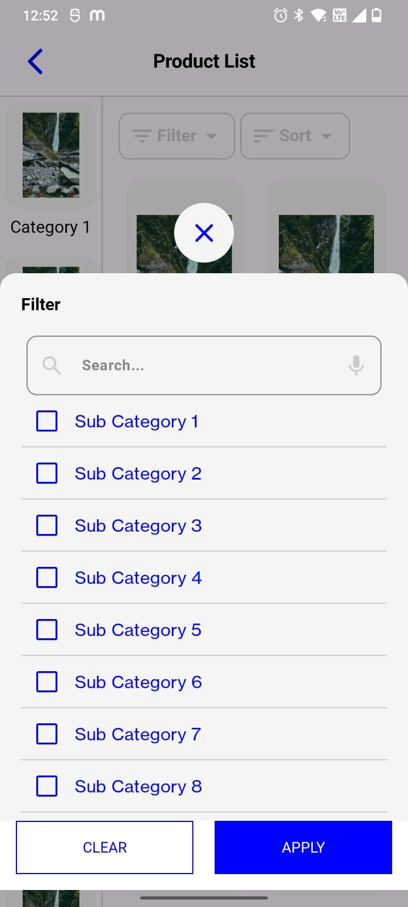
  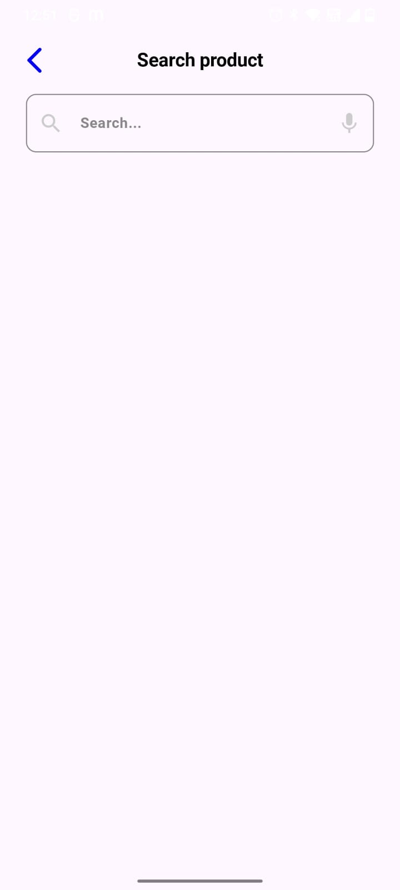

  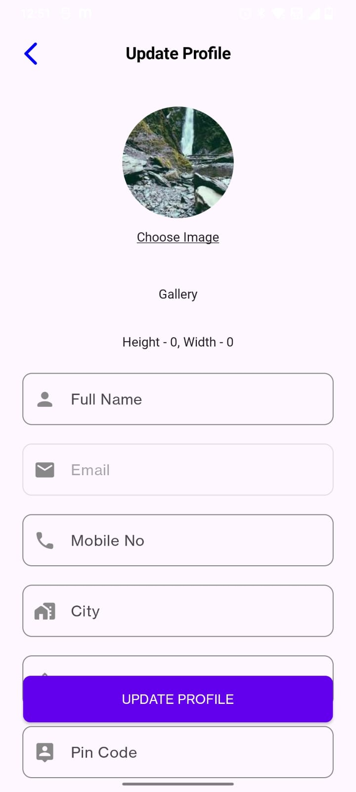
  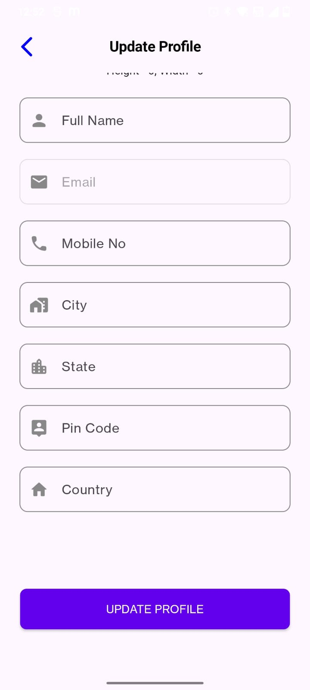
  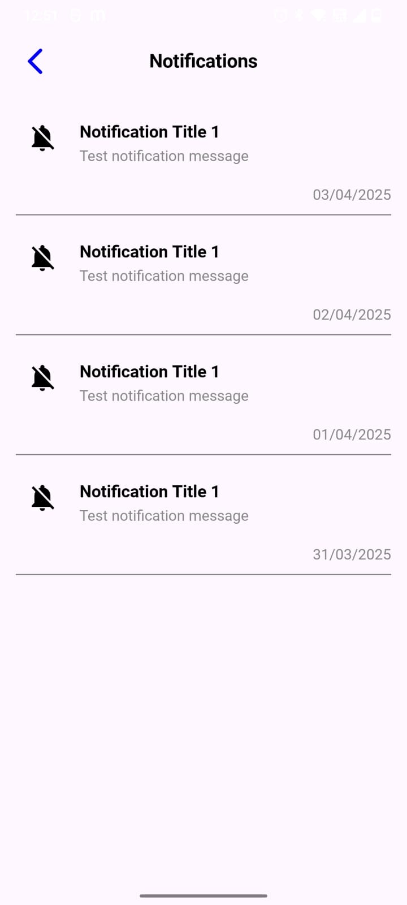

  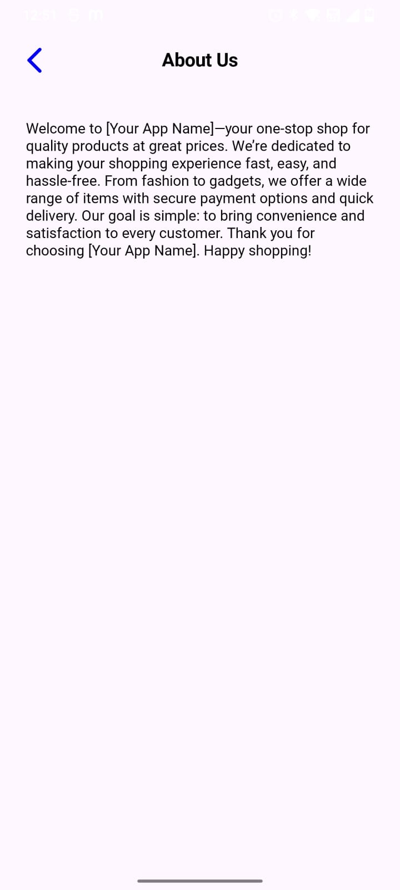
  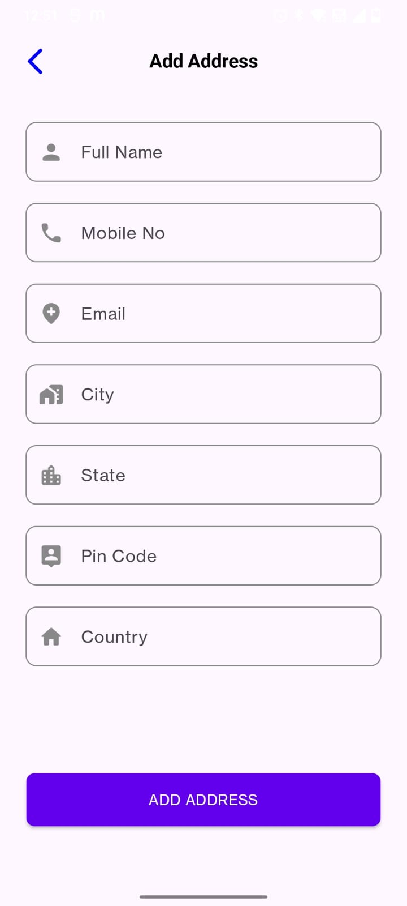
  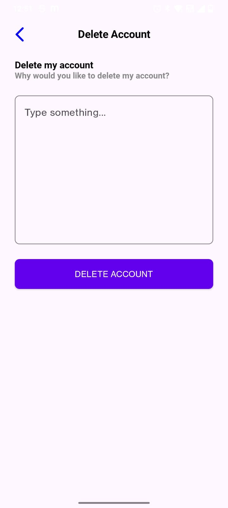

## 🛠️ Built With

- [Jetpack Compose](https://developer.android.com/jetpack/compose)
- [Material Design 3](https://m3.material.io/)
- Kotlin
- Android Studio

## 📁 Folder Structure

